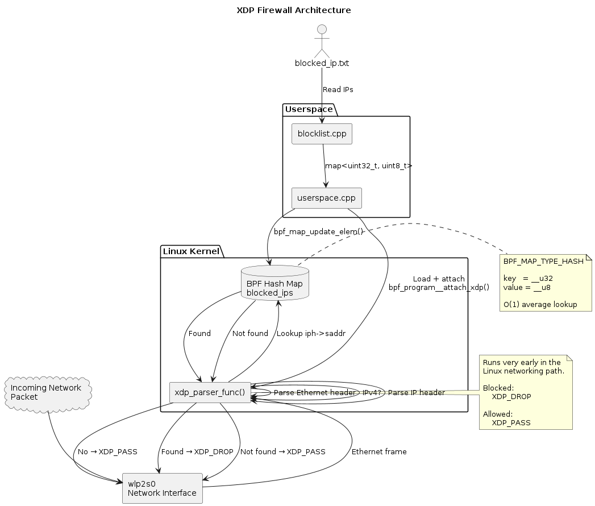

# XDP-based Firewall

**An XDP based firewall written in C/C++, a learning project.**

## How to run it:

- **Create BPF object file**
```
clang -O2 -g -target bpf -c bpf/xdp_firewall.bpf.c -o bpf/xdp_firewall.o
```
- **Compile executable**
```
clang++ -std=c++17 userspace.cpp blocklist.cpp -lbpf -o firewall
```
- Run the executable - in privileged mode
```
sudo ./firewall
```

## Working



**TLDR;** XDP allows in parsing packets **before they reach the kernel network network stack**, we can check the packet headers to retrieve the IP, check if they exist within our blocklist, send a XDP_DROP signal if it exists in our blocklist

## Room for improvement
- Currently XDP hook only works as an ingress (only incoming packets within wlp2s0 are parsed), egress hook needs to be added as well to parse outgoing packet headers.
- Make blocklist dynamically updatable
- TCP/UDP/IPv6 support 
- Logging


## Reference taken
- https://youtu.be/aD24HRMJ8cI?si=Ck5SgsoOJ8Am450r
- https://eunomia.dev
---

<p align="center">
  
</p>

